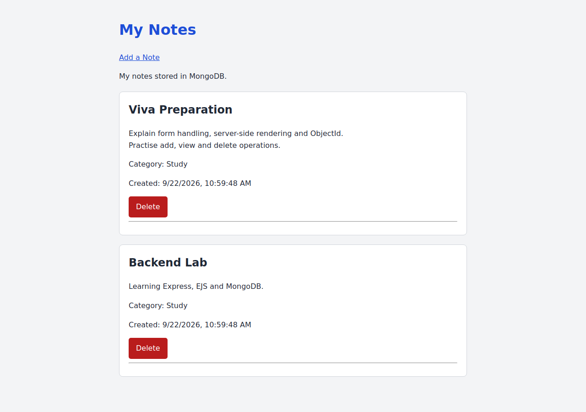

# Exam 01 — My Notes

**Name:** Saksham Katiyar  
**SAP ID:** 590015169

## Objective

Build a notes application with Express, EJS and MongoDB. Notes have a title, content, category and creation date. The application adds, displays and deletes notes using server-rendered pages.

## Run

From `LAB/Exam01`:

```bash
npm ci
```

For a fresh setup only, copy `.env.example` to `.env`. Keep your existing `.env` if it already contains a working connection.

```bash
cp .env.example .env
```

The exam supplies a running MongoDB server. The example configuration is:

```env
MONGODB_URI=mongodb://127.0.0.1:27017
DB_NAME=notes_lab
PORT=3000
```

For Atlas practice, put the Atlas URI in your private `.env` and allow your current public IP in Atlas Network Access. Do not upload credentials.

```bash
npm run check-db
npm start
```

Open http://localhost:3000. Use `npm run dev` for automatic restart during development.

## Exam requirement checklist

| Requirement | Implementation |
| --- | --- |
| Display every note and all four fields | GET / retrieves notes; index.ejs renders them |
| Message when there are no notes | No notes available |
| Add-note form | GET /notes/new renders new.ejs |
| Reject blank title and content | Type checks and trim on the server; 400 on invalid input |
| Save to MongoDB | insertOne with createdAt set to new Date |
| Redirect after saving | 303 redirect to / |
| Delete a selected note | POST /notes/:id/delete uses ObjectId and deleteOne |
| Server-side templates | EJS with escaped output |
| Error handling | 400 invalid ID/input; 404 absent note; 500 database errors |
| Optional interface enhancement | CSS in public/style.css |
| Submission files | Source, templates, CSS, this README and screenshot.png |

## Routes

| Method | Route | Purpose |
| --- | --- | --- |
| GET | / | Display all notes, newest first |
| GET | /notes/new | Display the form |
| POST | /notes | Validate and insert a note |
| POST | /notes/:id/delete | Delete the selected note |

## Files

- `app.js`: Express setup, MongoDB connection and routes
- `check-db.js`: standalone connection check
- `views/index.ejs`: list, empty state and delete forms
- `views/new.ejs`: form, retained input and validation feedback
- `public/style.css`: responsive styling
- `.env.example`: non-secret connection example
- `package.json` and `package-lock.json`: dependencies and run commands
- `screenshot.png`: rendered application screenshot

The private `.env` and `node_modules` are ignored by Git.

## Screenshot



This screenshot was captured from the submitted Express/EJS application using sample notes and an isolated collection test double. It demonstrates the interface, not a live Atlas connection or the contents of my personal database.

## Verification

During local practice I confirmed the empty state, adding notes, whitespace validation, deleting only the selected note, CSS styling and persistence across application restarts. Atlas connected successfully after adding my current IP.

On 22 September 2026, the uploaded application passed 12 isolated route checks: empty state, form rendering, blank title, blank content, missing fields, add redirect, displayed fields/default category, selected deletion, invalid ID, missing note, escaped output and CSS delivery. Mobile layout was checked at 390px with no horizontal overflow.

Those route checks used an in-memory collection double with the real Express/EJS code and MongoDB ObjectId type. They do not replace a live MongoDB test. No credentials were used in the review.

## Learning outcome

I can trace a form submission through parsing, validation and a MongoDB write, then explain how EJS turns retrieved documents into HTML. I can identify a document using ObjectId and explain why its data survives an application restart.

## Scope

This exam needs create, read and delete operations; editing is optional. CSS is the selected bonus enhancement. Login, authentication, PostgreSQL and a separate REST API are not required by the Exam01 sheet.

[Faculty Exam01 sheet](https://upessocs.github.io/Lectures/Backend%20Development/Lab/Exam%2001.md)
