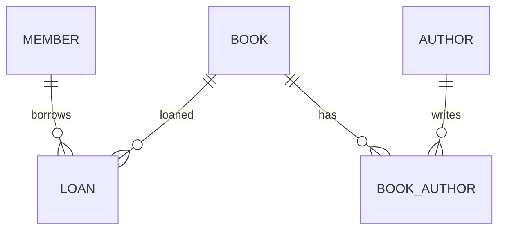

# Lecture 14A — Database Schema Design

**Name:** Saksham Katiyar  
**SAP ID:** 590015169

## Library Management ER design



The required entities are Book, Member, Loan and Author. `book_authors` is the junction table for the many-to-many Book–Author relationship. A member can have many loans; a book can appear in many loans over time. `library.sql` creates the tables with primary keys, foreign keys, required fields, unique ISBN/email and a return-date check. It inserts sample data and runs a joined query.

## Normalization to 3NF

The given order table repeats the customer and product details on each order line. Its key is `(order_id, product_name)` for the sample, assuming a product appears once in an order. Customer details depend on the order's customer, and product price depends on the product, so they should not be copied into every order line.

I separated it into `customers`, `products`, `orders` and `order_items`. `order_items` stores only the order, product and quantity. Customer details are kept once; product details are kept once. The foreign keys connect the tables. `orders_3nf.sql` creates these tables, inserts the three given rows in normalized form and joins them to reproduce the original view.

Run on a new PostgreSQL practice database:

```bash
createdb schema_practice
psql -d schema_practice -f library.sql
psql -d schema_practice -f orders_3nf.sql
```

The SQL was checked with an equivalent SQLite execution. PostgreSQL execution still needs your local installation.
